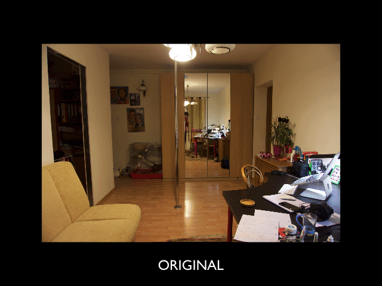

# Lensfunpy Playground

The following [example](correct.py) shows how [lensfunpy](https://github.com/letmaik/lensfunpy) deals with distortion correction for a exemplary photograph taken by **Sony ILCE-5000** with **16-50mm f/3.5-5.6 OSS** lens.

